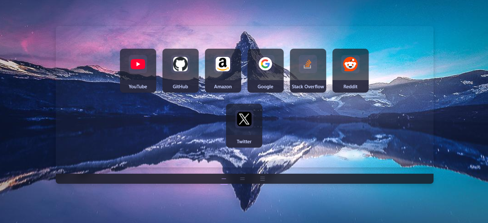

# DMX New Tab

A customized new tab page providing:
- Weather and RSS Feeds
- Notes and To-Do list
- Shortcut sections
- Minimal, clean UI

Try out the tab page [here](https://demitrix2k.github.io/DMX-Tab/)

## Features
- Three tabs (Shortcuts, Weather & Feeds, Notes & Todo)
- Add and manage shortcuts in organized rows
- Weather updates with location or custom city
- RSS feeds for personalized news
- Editable notes area and to-do list
- Flexible settings for export, import, and resetting configuration

## Getting Started
1. Open index.html in your browser to view the tab layout.
2. Customize backgrounds, shortcuts, and other settings from the various configuration panels.
3. Enjoy a personalized start page each time you open a new tab.

## License
This project is for personal, educational, or internal use. No formal license is specified.
